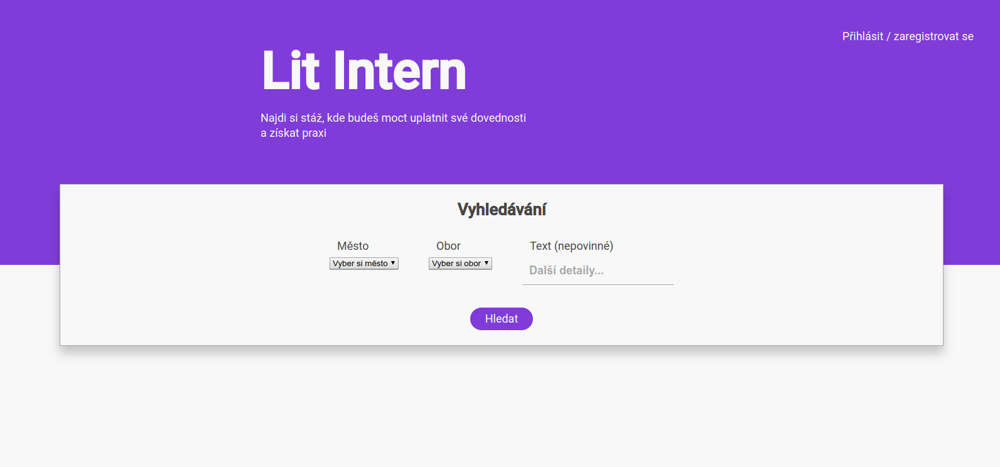
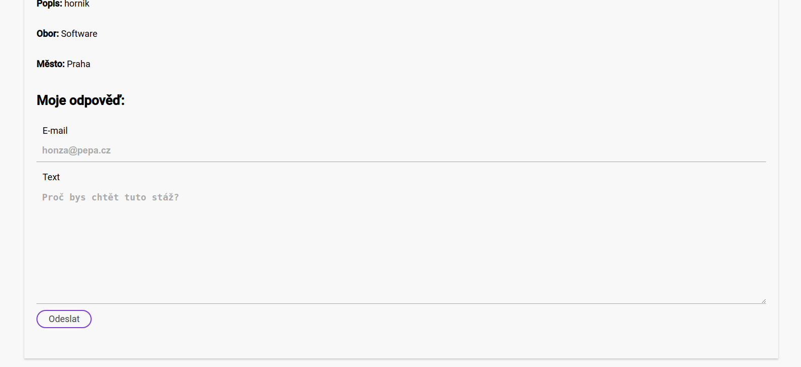
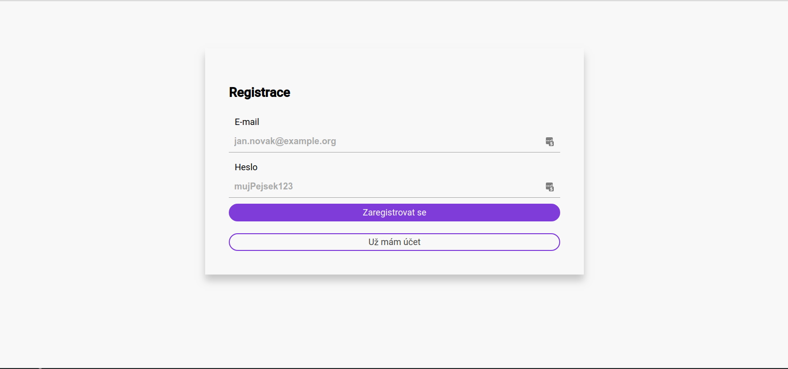
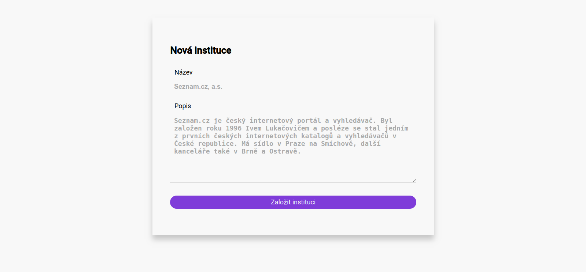
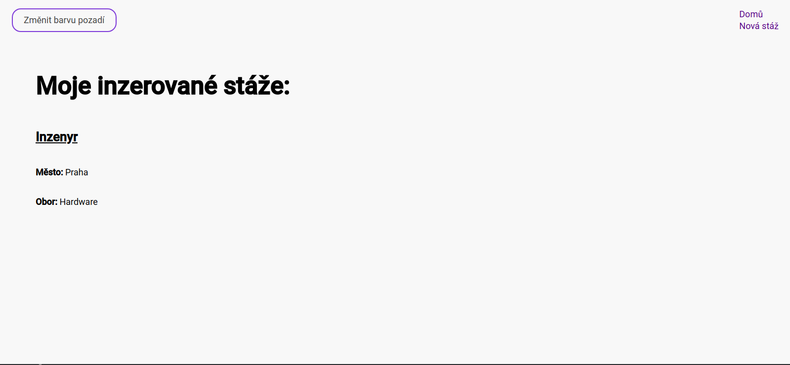
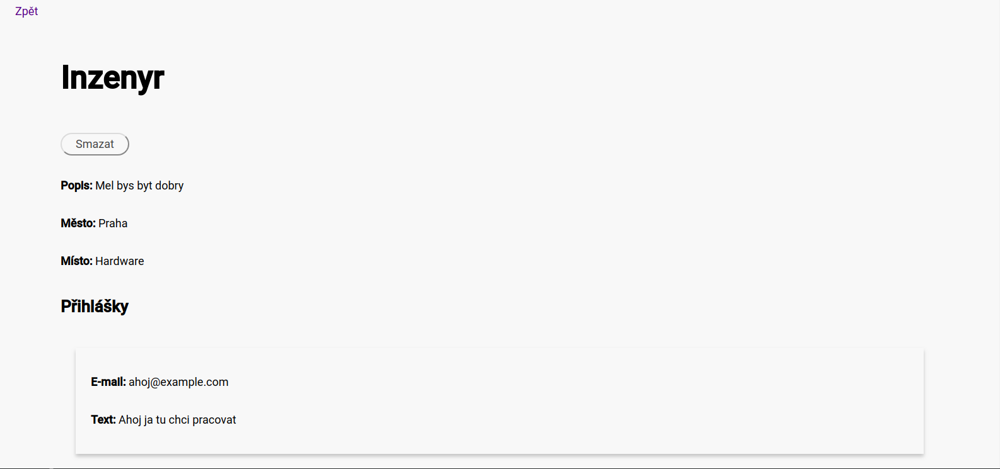

# Uživatelská příručka

## Hlavní sekce
+ Vpravo nahoře je odkaz na přihlašování uživatelů
+ Uprostřed je hlavní vyhledávací formulář stáží

## Odpověď na stáž
+ Tady mohou zájemci odpovědět na nabídku na stáž

## Přihlášení / registrace
+ Zde se uživatelé mohou přihlásit nebo registrovat

## Vytvoření instituce
+ Zde si uživatelé vytvoří profil instituce

## Přehled stáží
+ Zde uživatelé vidí své vypsané stáže

## Detail stáže
+ Zde jsou vidět všechny odpovědi zájemců o stáž

